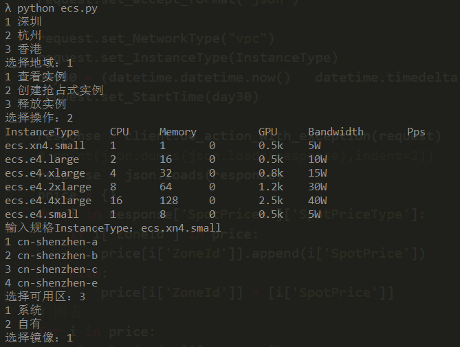

# Aliyun产品管理脚本

调用官方Openapi实现，避免登录网页控制台操作

> 官方SDK https://github.com/aliyun/aliyun-openapi-python-sdk

> API测试 https://api.aliyun.com/new

> ECS API https://help.aliyun.com/document_detail/25485.html

> 专有网络VPC API https://help.aliyun.com/document_detail/35748.html

## 目前已实现功能

* ECS管理（ecs.py）
    * 查询已创建的ECS
    * 创建ECS（暂只支持抢占式实例）
    * 释放ECS

## 环境准备

- 在阿里云控制台中的 [AccessKey管理页面](https://usercenter.console.aliyun.com/?spm=5176.doc52740.2.3.QKZk8w#/manage/ak) 上创建和查看您的 Access Key，然后替换到源码中相应位置

- 安装依赖包

    ```bash
    pip install aliyun-python-sdk-core  # 安装阿里云 SDK 核心库
    pip install aliyun-python-sdk-ecs   # 安装管理 ECS SDK
    pip install matplotlib  # 用于查看各可用区近30日价格
    ```

## 使用示例

- 例如创建抢占式实例，执行运行 `python ecs.py` ，按提示操作

    

    